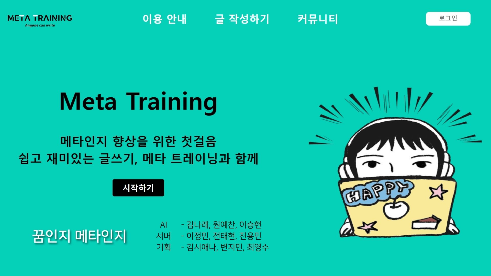
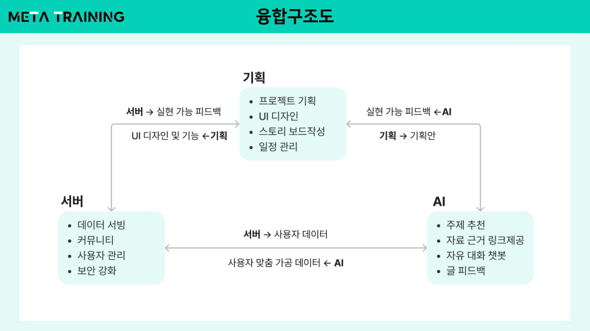
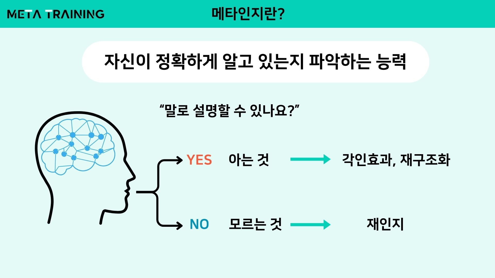
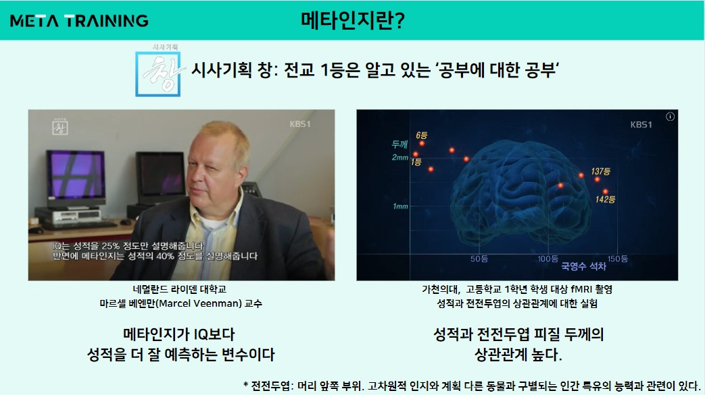
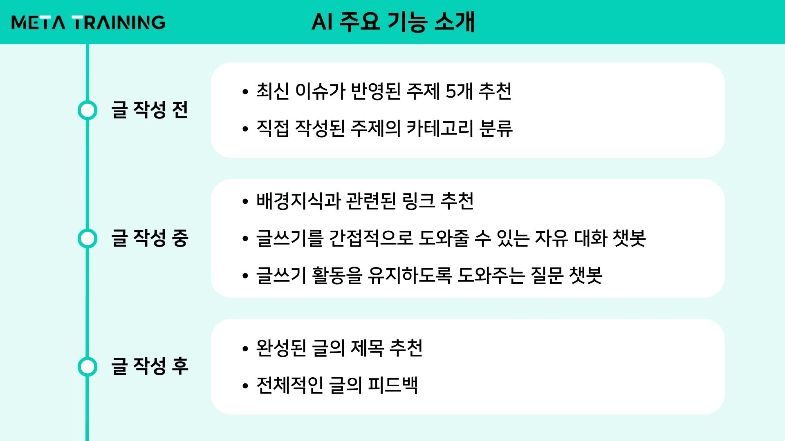
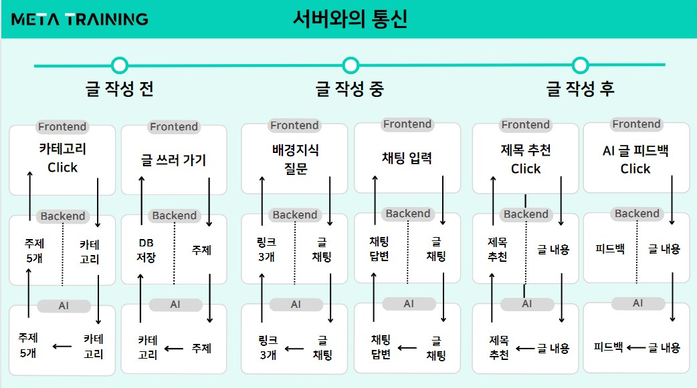
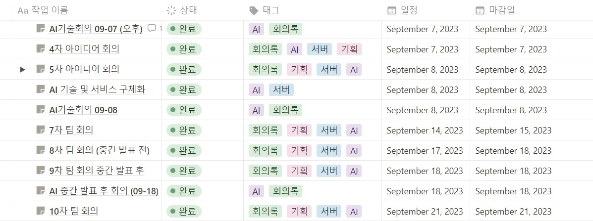
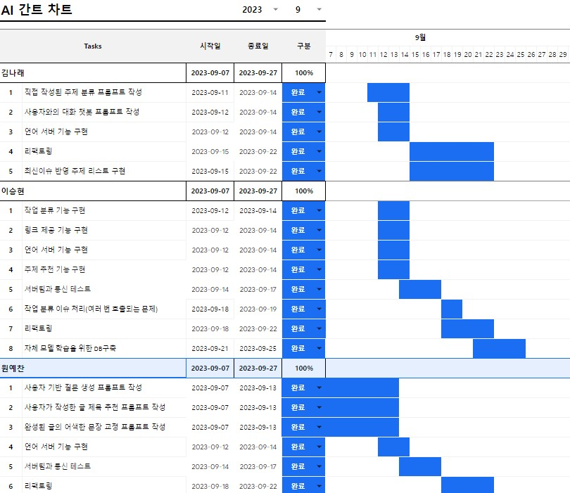

# Meta Training: 메타인지 향상을 위한 글쓰기 보조 AI

### 🎥 시연 영상 보러가기(<a href="https://youtu.be/PF1W-fF4AwQ">Click!</a>) 
### 📙 발표자료 보러가기(<a href="C:/Users/user/Desktop/AI/Meta_Training_꿈인지_메타인지.pdf">Click!</a>)
### 📂 Google Drive 보러가기(<a href="https://drive.google.com/drive/folders/1oDagv1dsbvrkFJas_DQgVjtNZfi8g8iW">Click!</a>)

## 목차
* [💼 팀원 소개](#💼-팀원-소개)
* [💡 프로젝트 소개](#💡-프로젝트-소개)
* [✍ 주요 기능 소개](#✍-주요-기능-소개)
* [🪄 서버와의 통신](#🪄-서버와의-통신)
* [⚒️ 기술 스택](#⚒️-기술-스택)

## 💼 팀원 소개

<table>
    <tbody>
        <tr>
            <td align="center"><b>AI</b></td>
            <td align="center"><b>AI</b></td>
            <td align="center"><b>AI</b></td>
            <td align="center"><b>서버</b></td>
            <td align="center"><b>서버</b></td>
            <td align="center"><b>서버</b></td>
            <td align="center"><b>기획</b></td>
            <td align="center"><b>기획</b></td>
            <td align="center"><b>기획</b></td>
        </tr>
        <tr>
            <td align="center"><a href="https://github.com/narae3759" target='_blank'><b>김나래</b></a></td>
            <td align="center"><a href="https://github.com/yechan-9208" target='_blank'><b>원예찬</b></a></td>
            <td align="center"><a href="https://github.com/Blessian" target='_blank'><b>이승현</b></a></td>
            <td align="center"><a href="https://github.com/jiwon11" target='_blank'><b>이정민</b></a></td>
            <td align="center"><a href="https://github.com/JeonTaeHyeon" target='_blank'><b>전태현</b></a></td>
            <td align="center"><a href="https://github.com/CodeJugller" target='_blank'><b>진용민</b></a></td>
            <td align="center"><a href="" target='_blank'><b>김시애나</b></a></td>
            <td align="center"><a href="" target='_blank'><b>변지민</b></a></td>
            <td align="center"><a href="" target='_blank'><b>최영수</b></a></td>
        </tr>
    </tbody>
</table>

### 🤝 융합 구조도

### 👨‍💻 AI 팀 역할

<table>
    <tbody>
        <tr>
            <td><b>김나래</b></td>
            <td>최신 이슈 반영, 주제의 카테고리 분류, 자유 대화 챗봇</td>
        </tr>
        <tr>
            <td><b>원예찬</b></td>
            <td>질문 챗봇, 글 제목 추천, 글 피드백</td>
        </tr>
        <tr>
            <td><b>이승현</b></td>
            <td>주제 추천, 링크 추천, 학습데이터 DB구축</td>
        </tr>
    </tbody>
</table>

## 💡 프로젝트 소개

### ✏️ 메타인지 소개

### 🧠 주제 선정 배경

<!-- * 2018 국제학업성취도평가(PISA)
    * 한국의 학업성취도: 읽기(5위), 수학(2위), 과학(4위)
    * 한국의 삶의 만족도 : 71개국 중 65위
* 한국의  -->

> [출처: 전교 1등은 알고 있는 ‘공부에 대한 공부’](https://news.kbs.co.kr/news/pc/view/view.do?ncd=2889718)

## ✍ 주요 기능 소개

### 1️⃣ 글 작성 전

1. **최신 이슈가 반영된 주제 5개 추천** 👩‍💻`김나래` 👨‍💻`이승현`
* **작동 조건**: USER가 카테고리를 클릭할 때 
* **이슈 및 해결과정**
    * 질문에 번호가 자동으로 부여되어 출력됨 
    $/rightarrow$ 프롬프트 재작성
    * gpt4에 최신이슈가 반영되지 않는 문제 발생 
        * solution 1. 웹 크롤링을 통한 LDA 
        $/rightarrow$ 키워드가 너무 광범위하며 선택과정에 개발자의 의견이 들어가게 됨.
        * solution 2. google bard를 이용한 추출 
    $/rightarrow$ 2023년 08월까지 반영되어 있어 적절한 주제를 추천받을 수 있음 
    $/rightarrow$ **But** API가 session token으로 되어 있어 일정 시간이 지나면 업데이트 되어 지속적으로 사용하기 적절치 않음. 
    $/rightarrow$ 달마다 업데이트 되는 방식을 채택하여 csv 파일로 변환하는 방식으로 진행하고자 함.

2. **직접 작성된 주제의 카테고리 분류** 👩‍💻`김나래`
* **작동 조건**: 운영자가 제공하는 '오늘의 주제'이거나 USER가 '직접 입력'한 경우
* **분류 기준**: 일상, 사회, 과학, 스포츠, 문화/예술, 환경
* **이슈 및 해결과정**
    * prompt 결과에 `"`(따옴표)가 중복으로 적용되어 출력됨. 
    $/rightarrow$`replace`함수로 전처리 과정을 거침.

### 2️⃣ 글 작성 중

1. **의도 분류 챗봇** 👨‍💻`이승현`
* **작동 조건**: USER가 채팅창에 입력한 경우
* **분류 기준**: 배경지식, 자유대화
* **이슈 및 해결과정**
    * 중복 응답이 발생 
    $/rightarrow$ langchain의 memory 기능을 이용하여 중복 응답 발생을 최소화 함.

2. **배경지식과 관련된 링크 추천** 👨‍💻`이승현`
* **작동 조건**: USER가 배경지식이라고 의도를 분류한 경우
* **분류 기준**: 배경지식, 자유대화
* **이슈 및 해결과정**
    * 할루시네이션 발생, 잘 생성한 것처럼 보이지만 링크로 이동하면 없는 페이지(404)라고 나오거나 관련 없는 페이지가 나오는 문제가 발생함. 
    $/rightarrow$ 
    마이크로소프트의 Bing Chat이 인터넷 검색을 통해 정확한 링크를 제공하는 방식을 관찰하여 링크를 직접 생성하는 대신 적절한 검색어를 생성하여 검색 결과를 크롤링하는 방식으로 구현
    * 링크를 수집하던 중 한글로 이루어진 링크들이 수집 과정에서 변형되어 기능을 상실하는 문제 발생 
    $/rightarrow$
    urllib의 `unquote_plus()` 함수를 통해 url을 재가공하여 해결

3. **글쓰기를 간접적으로 도와줄 수 있는 자유 대화 챗봇** 👩‍💻`김나래`
* **작동 조건**: USER가 자유대화라고 의도를 분류한 경우
* **이슈 및 해결과정** 
☝️Point! USER가 챗봇의 결과를 그대로 복붙하지 않고 직접 쓸 수 있게 해야 한다.
    

    
SYSTEM 기본설정

    

    <ul>
        <li>USER는 14세 이상 20세 미만의 1인 청소년이다. 대상에 맞춰 쉽게 설명해야 한다.
        </li>
        <li>SYSTEM은 USER가 글쓰는 행위를 중단하는 제안을 해서는 안된다.</li>
        <li>USER의 현재 진행중인 글은 리스트 안에 주제와 내용으로 표현되어 있다.</li>
        <li>SYSTEM은 USER가 현재 쓰고 있는 글을 기반으로 답변해야 한다.</li>
    </ul>
    

    

    

    
USER 상황 가정

    

    <ul>
        <li>SYSTEM이 주제와 관련된 답변을 해야 하는 경우 
        리스트의 정보에 포함된 정보는 제외하고 답변해야 한다. 
        긴 문장이 아닌 번호 리스트 또는 질문으로 표현해야 한다.</li>
        <li>USER가 글쓰기를 어려워하고, 하기 싫어하는 경우 
        격려의 말로 시작하며, 주제와 관련한 방향성을 3가지 이내로 제안 또는 질문해야 한다.</li>
        <li>USER가 글을 써 달라고 직접적으로 요청하거나 SYSTEM에게 주제와 관련한 생각이나 의견을 구체적으로 물을 때 
        정중하게 거절한 후 다양한 방향성을 5가지 이내로 제안 도는 질문해야 한다. 
        USER가 요청하기 전까지 거절 답변을 해서는 안된다.</li>
    </ul>
    

    

4. **글쓰기 활동을 유지하도록 도와주는 질문 챗봇** 👨‍💻`원예찬`
* **작동 조건**: USER가 챗봇 아이콘을 클릭하는 경우
* **이슈 및 해결과정** 

### 3️⃣ 글 작성 후

1. **완성된 글의 제목 추천** 👨‍💻`원예찬`
* **작동 조건**: USER가 챗봇 아이콘을 클릭하는 경우
* **이슈 및 해결과정** 
 
2. **전체적인 글의 피드백** 👨‍💻`원예찬`
* **작동 조건**: USER가 챗봇 아이콘을 클릭하는 경우
* **이슈 및 해결과정** 

3. **학습 데이터 DB 구축** 👨‍💻`이승현`
* 발표 전 서비스의 시뮬레이션을 한 결과 OpenAI의 API를 사용했을 때 사용자가 글 하나를 완성하는데 드는 비용은 <u><b>평균 300 ~ 400원 정도</b></u>로 나타남. 
$/rightarrow$ 비용부담이 상당할 것으로 예상되어 지속적인 서비스와 맞춤형 서비스로 구체화 하기 위해서는 자체적인 LLM을 구축하여 서비스해야 하는 것이 장기적으로 유리하다고 판단.
* 프롬프트, 사용자 입력, 대화 내역, 출력 등을 수집하고 DB에 저장함.

## 🪄 서버와의 통신

## ⚒️ AI 기술 스택
&nbsp;
&nbsp;
&nbsp;
&nbsp;
&nbsp;
&nbsp;

## 👫 협업 툴

### 👥 회의

### 📆 간트 차트

